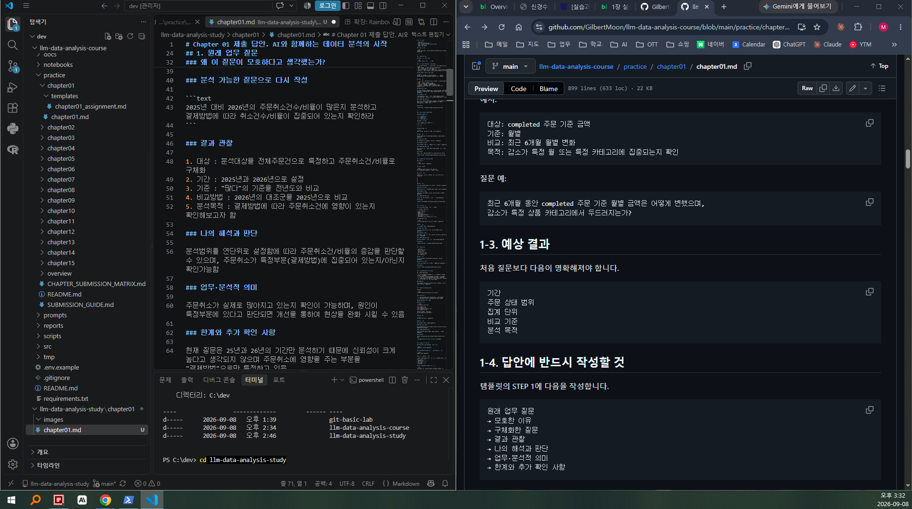
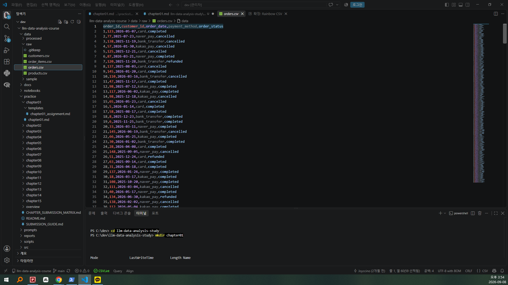
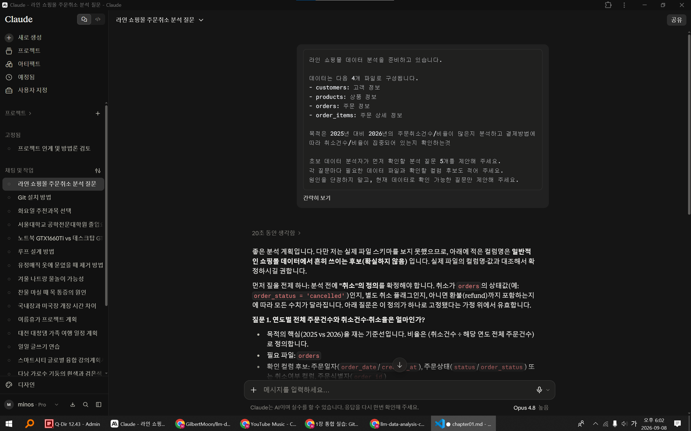
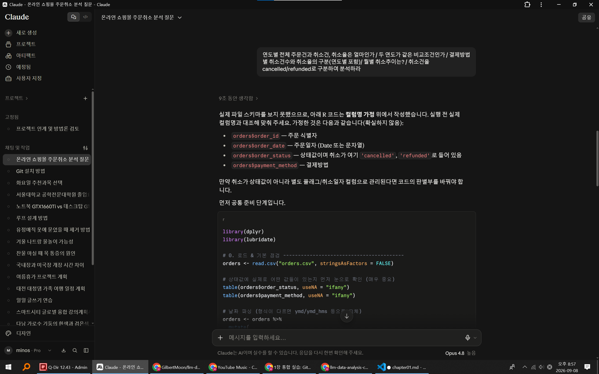
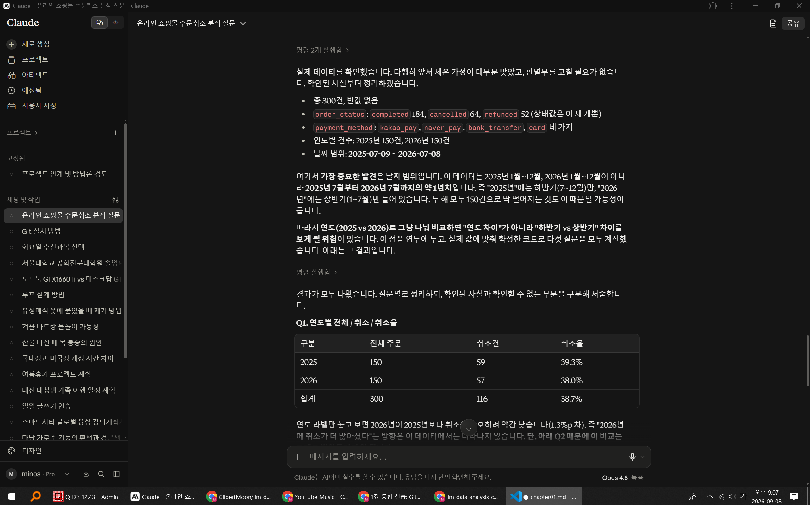

# Chapter 01 제출 답안. AI와 함께하는 데이터 분석의 시작

> 이 파일은 Chapter 01 실습 결과를 정리하여 제출하기 위한 학생용 템플릿입니다.  
> 강사 저장소의 원본 템플릿을 직접 수정하지 말고, 자신의 PC에 복사한 뒤 작성합니다.

---

## 0. 제출 정보

- 이름: 예민호
- GitHub ID: yegamanse-cpu
- 개인 저장소명: `llm-data-analysis-study`
- 작성일: 2026-09-08
- 사용한 LLM: 클로드

### 최종 제출 URL

```text
https://github.com/yegamanse-cpu/llm-data-analysis-study/blob/main/chapter01/chapter01.md
```

---

## 1. 원래 업무 질문

### 내가 선택한 막연한 질문

```text
주문취소로 처리된 건이 많은것 같다.
```

### 왜 이 질문이 모호하다고 생각했는가?

- 대상: 전체주문건에 대한 주문취소건인지 특정 범위의 취소건인지 불분명
- 기간: 기간에 대한 특정이 없어 분석범위가 모호함
- 기준: "많다"의 기준없음(적정 비율?)
- 비교 방법: 비교기준이 되는 대조군이 없어 많다/적다 판단 어려움
- 분석 목적: 많다/적다 분석를 통하여 어떤것을 하려는 목적이 없음

### 분석 가능한 질문으로 다시 작성

```text
2025년 대비 2026년의 주문취소건수/비율이 많은지 분석하고 결제방법에 따라 취소건수/비율이 집중되어 있는지 확인하라
```

### 결과 관찰

1. 대상 : 분석대상을 전체주문건으로 특정하고 주문취소건/비율로 구체화
2. 기간 : 2025년과 2026년으로 설정
3. 기준 : "많다"의 기준을 전년도와 비교
4. 비교방법 : 2026년의 대조군을 2025년으로 비교
5. 분석목적 : 결제방법에 따라 주문취소건에 영향이 있는지 확인해보고자 함

### 나의 해석과 판단

분석범위를 연단위로 설정함에 따라 주문취소건/비율의 증감을 판단할 수 있으며, 주문취소가 특정부분(결제방법)에 집중되어 있는지/아닌지 확인가능함

### 업무·분석적 의미

주문취소가 실제로 많아지고 있는지 확인이 가능하며, 원인이 특정부분에 있다고 판단되면 개선을 통하여 현상을 완화 시킬 수 있음

### 한계와 추가 확인 사항

현재 질문은 25년과 26년의 연단위 기간만 분석하기 때문에 신뢰성이 크게 높다고 생각되지 않으며 주문취소에 영향을 주는 부분을 "결제방법"으로만 특정하고 있음


### Evidence



---

## 2. 질문과 필요한 데이터 연결

### 필요한 데이터 파일

- [ ] `customers.csv`
- [ ] `products.csv`
- [x] `orders.csv`
- [ ] `order_items.csv`

### 필요한 컬럼 후보

| 파일 | 필요한 컬럼 | 필요한 이유 |
| --- | --- | --- |
| orders.csv | order_id | 주문취소율을 구하기 위해 전체주문건수 필요 |
| orders.csv | order_date | 분석범위를 특정하기 위함 |
| orders.csv | payment_method | 결제방법에 따라 분석범위 분리 |
| orders.csv | order_status | 주문완료/취소 구분 |


### 데이터 연결 관계

분석에 필요한 데이터가 orders.csv에 다 포함되므로 별도 fk는 필요없다고 판단


### 결과 관찰

orders.csv의 칼럼을 살펴보면 전체주문건수/취소건수/날짜/결제방법/취소여부 모두 확인가능


### 나의 해석과 판단

현재 데이터로 분석가능할 것으로 판단됨. 


### 업무·분석적 의미

질문에 대한 데이터의 확보/적정 구조가 분석에 필수항목이 때문(질문이 구체적이라도 분석이 되는 데이터가 적정하지 않으면 진행불가) 


### 한계와 추가 확인 사항

결측여부는 자세히 살펴보지 못했으며, 각 항목들의 상태가 일괄적으로 필터링이 가능한 구조인지는 확인하지 못함


### Evidence

필요한 경우 관계도 또는 데이터 파일 확인 화면을 첨부하세요.




## 3. LLM에게 분석 질문 후보 요청

### 사용 목적

기초데이터를 엑셀 등으로 직접 분석가능하나 LLM을 통하여 보다 빠르고 효율적으로 분석하기 위함


### 사용한 Prompt

"온라인 쇼핑몰 데이터 분석을 준비하고 있습니다.

데이터는 다음 4개 파일로 구성됩니다.
- customers: 고객 정보
- products: 상품 정보
- orders: 주문 정보
- order_items: 주문 상세 정보

목적은 2025년 대비 2026년의 주문취소건수/비율이 많은지 분석하고 결제방법에 따라 취소건수/비율이 집중되어 있는지 확인하는것 

초보 데이터 분석자가 먼저 확인할 분석 질문 5개를 제안해 주세요.
각 질문마다 필요한 데이터 파일과 확인할 컬럼 후보도 적어 주세요.
원인을 단정하지 말고, 현재 데이터로 확인 가능한 질문만 제안해 주세요."


### LLM 답변 요약

1. 연도별 전체 주문건과 취소건, 취소율은 얼마인가
2. 두 연도가 같은 비교조건인가
3. 결제방법의 구성은 어떤가
4. 결제방법별 취소건수와 취소율의 구분(연도별 포함)
5. 월별 취소추이는?


### 결과 관찰

클로드는 보다 세부적인 추가 비교형태의 질문을 제안


### 나의 해석과 판단

원본 데이터를 살펴보니 2025년과 2026년이 동일기간이 되지 않아 주문비율로 비교하는것이 타당하다고 생각하며, 연단위 분석이 너무 러프할 수 있어 월단위 추이를 보는것도 유용할 것으로 판단

### 업무·분석적 의미

분석 시작단계에서 미쳐 생각하지 못했던 세부정의를 내릴 수 있음. 예를들면 분석기간이 맞지 않아 취소건수가 아닌 취소율로 확인하는것이나 월별 추이를 보는 방법 등

### 한계와 추가 확인 사항

제안사항들은 실제 값을 모르기 때문에 데이터를 넣고 제안한 내용들이 유의미한 분석이 될지는 직접 수행을 해야 함

### Evidence

 

## 4. LLM 제안 검증

LLM 제안 중 하나 이상을 선택해 검토합니다.

| 검증 항목 | 확인 내용 |
| --- | --- |
| 선택한 LLM 제안 | 연도별 전체 주문건과 취소건, 취소율은 얼마인가 / 두 연도가 같은 비교조건인가 / 결제방법별 취소건수와 취소율의 구분(연도별 포함) / 월별 취소추이는?  |
| 필요한 파일 | orders.csv |
| 필요한 컬럼 | order_id, order_date, order_status |
| 계산 범위 | 전체 주문건 order_id 추출 / 연도별 월별 데이터 order_date 추출 / payment_method 결제방법 구분 | order_status 주문취소 구분 | 
| 실제 데이터 확인 필요 여부 | orders.csv 확인결과 데이터 정상 |
| 원인 단정 여부 | 별도의 원인단정은 없음 |
| 최종 판단 | 수정 후 사용 |

### 내가 수정한 내용

```text
취소건을 cancelled/refunded로 구분하여 분석하라
```

### 결과 관찰

대체로 제안한 내용들이 적정하다고 생각되나 주문취소건이 cancelled와 refunded구분이 되지 않음

### 나의 해석과 판단

"취소건을 cancelled/refunded로 구분하여 분석하라"라는 제안을 추가하여 분석하면 결제방법에서 문제점을 구분할 수 있을것으로 판단
 
### 업무·분석적 의미

우선 기본데이터에 LLM이 제안하는 데이터가 있는지 파악하는게 우선이며 데이터가 적절한지 결측이 있는지를 파악해야 원하는 결과를 더 빨리 도출할 수 있음

### 한계와 추가 확인 사항

아직 원본데이터를 LLM이 확인하지 않았으므로 명확한 결과가 나오지 않음

### Evidence



## 5. Prompt Log

- 사용 목적: 주문취소가 실제로 많아지고 있는지 확인하고, 원인이 특정부분에 있는지 판단
- 입력 Prompt 요약: 연도별 전체 주문건과 취소건, 취소율은 얼마이며, 두 연도가 같은 비교조건인가? 결제방법별 취소건수와 취소율을 구분하고 월별 취소추이 및 취소건을 cancelled/refunded로 구분하여 분석하라
- LLM 답변 요약: 전체 취소율은 오히려 소폭 낮아졌음. 두 연도가 건수는 같지만 같은 계절이 아니라 결과가 왜곡될 수 있으며 결제방법별 취소건과 및 월별추이 분석은 표본이 적어 특정이 어려움. cancelled/refunded로 구분한 취소율은 두해가 비슷하지만 cancelled의 비중이 2026년에는 줄고 refunded의 비중이 높아진 것을 확인할 수 있음
- 실제 반영 여부: 반영
- 사람이 검증한 항목: 원본데이터 칼럼확인
- 사람이 수정한 내용: 제안항목 중 주문취소에 대한 구분(cancelled/refunded)을 요청
- 남은 확인 사항: 추가데이터 취득여부 확인필요

### 결과 관찰

2025년과 2026년이 같은 비교조건이 아님이 확인되어 취소율을 보는것이 유의미하며 결제방법별/월별추이 분석은 표본이 부족함. 취소건(cancelled/refunded)을 구분하면 원인파악에 도움이 될것으로 판단되나 동기간이 아니라 결과가 왜곡될 수 있으므로 보다 정확한 해석을 추가적인 자료취득이 필요함 


### 나의 해석과 판단

제안사항의 목적과 한계를 구별할 수 있으며 분석에 더 필요한 내용을 식별하게 함

### Evidence




## 6. 개인정보와 Secret 보호 확인

다음 항목을 확인합니다.

- [x] 실제 이름·이메일·전화번호 등 고객 개인정보를 Prompt에 사용하지 않았습니다.
- [x] API Key를 코드나 Notebook에 직접 작성하지 않았습니다.
- [x] `.env` 실제 내용을 캡처하거나 업로드하지 않았습니다.
- [x] GitHub Token, 비밀번호, 내부 URL이 캡처에 보이지 않습니다.
- [x] 제출 전 이미지까지 다시 확인했습니다.

### 나의 판단

고객 개인정보 및 주문정보 등은 2차가공을 통하여 악용될 수 있으므로 업로드 금지필요 판단

---

## 7. Chapter 01 Notebook 확인

Notebook:

```text
notebooks/ch01_ai_data_analysis_intro.ipynb
```

### 내 환경 상태

- [x] 아직 환경설정 전이라 Notebook 위치만 확인했습니다.
- [ ] 환경설정이 완료되어 Notebook을 직접 실행했습니다.


### 환경설정 완료 학생만 작성

#### 실행한 코드

```python
from pathlib import Path

import pandas as pd
import numpy as np
import matplotlib.pyplot as plt
import seaborn as sns

DATA_DIR = Path('../data/raw')
sns.set_theme(style='whitegrid')
```

#### 실행 결과

```text
오류 없이 실행되었는지 작성하세요.
```

#### 결과 관찰

실행 결과에서 확인한 사실을 작성하세요.

#### 나의 해석과 판단

현재 Notebook이 본격 분석이 아니라 starter scaffold라는 의미를 자신의 말로 설명하세요.

#### 한계와 추가 확인 사항

상태: 실행 전

이유: Chapter 02에서 Python/VS Code/Jupyter 환경 설정 후 실행 예정


#### Evidence


> 환경설정 전이라면 이 이미지는 생략할 수 있습니다.

---

## 8. Chapter 01 최종 해석

### 이번 장에서 가장 중요하다고 생각한 내용

```text
내가 이해하는 언어로 질문하기 보다 LLM이 이해하는 언어로 질문을 해야 원하는 결과를 빠르게 얻어 낼 수 있으며 원본데이터를 확인하여 세부적인 부분까지 구별하여 지시해야 함
```

### LLM을 데이터 분석에 사용할 때 가장 조심해야 할 점

```text
데이터가 충분히 확보되지 않으면 아무리 분석을 잘 해도 확증편향이 될 수 있을거라고 생각함. 때문에 충분한 데이터와 아주 구체적인 목적과 질문이 있어야 LLM의 장점을 활용할 수 있을 것임.
```

### 사람과 LLM의 역할 차이

| 항목 | LLM이 도울 수 있는 부분 | 사람이 책임져야 하는 부분 |
| --- | --- | --- |
| 질문 정의 | o | o |
| 데이터 확인 |  | o |
| 코드 작성 | o | o |
| 결과 해석 | o | o |
| 최종 판단 |  | o |

### 다음 Chapter에서 확인하고 싶은 것

```text
아직 vscode나 프로그래밍 언어에 익숙하지 않아 과제수행에 시간이 꽤 소요되었는데 앞으로 배울 챕터에서 이를 좀 더 효율적으로 수행하는 방법을 확인하고 싶음
```

---

## 9. 최종 제출 체크리스트

- [x] 원래 업무 질문과 구체화한 분석 질문을 작성했습니다.
- [x] 질문에 필요한 데이터 파일과 컬럼 후보를 정리했습니다.
- [x] LLM Prompt와 답변 요약을 작성했습니다.
- [x] LLM 제안을 실제 데이터 관점에서 검증했습니다.
- [x] 각 핵심 STEP의 결과 관찰을 작성했습니다.
- [x] 각 핵심 STEP의 나의 해석과 판단을 작성했습니다.
- [x] 업무·분석적 의미를 작성했습니다.
- [x] 한계와 추가 확인 사항을 작성했습니다.
- [x] 핵심 실행 Evidence 이미지를 첨부했습니다.
- [x] 이미지가 Markdown에서 정상 표시됩니다.
- [x] 개인정보가 없습니다.
- [x] API Key·Secret·Token이 없습니다.
- [x] 개인 GitHub 저장소에 업로드했습니다.
- [x] GitHub에서 Markdown과 이미지가 정상 표시됩니다.
- [x] 아래 최종 파일 URL이 정상적으로 열립니다.

### 최종 파일 URL

```text
https://github.com/yegamanse-cpu/llm-data-analysis-study/blob/main/chapter01/chapter01.md
```

---

## 10. 교수자 확인용 요약

### 수행 상태

- [x] COMPLETE
- [ ] PARTIAL

### 내가 가장 중요하게 내린 판단 1개

```text
두 연도가 동일 기간이 아니므로, 취소 건수 비교 대신 취소율로 비교하기로 판단했다
```

### 아직 확인이 필요한 내용 1개

```text
상·하반기 왜곡을 제거하려면 두 해가 겹치는 동일 기간의 데이터를 추가로 확보해야 한다
```
