# 2장 실습. VS Code에서 시작하는 데이터 분석 환경

> 이 문서는 학생이 그대로 따라 할 수 있도록 작성한 실습 진행 가이드입니다.  
> Chapter 02의 목표는 **VS Code + Python + `.venv` + Jupyter Notebook + 샘플 데이터**를 하나의 정상 실행 환경으로 연결하는 것입니다.

---

## 실습 목표

이 실습을 마치면 다음을 직접 확인할 수 있어야 합니다.

- Public 실습 저장소를 준비할 수 있습니다.
- 프로젝트 루트 위치를 확인할 수 있습니다.
- `.venv` 가상환경을 생성하고 활성화할 수 있습니다.
- `requirements.txt`로 패키지를 설치할 수 있습니다.
- 현재 Python 실행 파일이 `.venv`인지 확인할 수 있습니다.
- VS Code Python 인터프리터와 Jupyter Notebook 커널을 같은 `.venv`로 선택할 수 있습니다.
- 샘플 데이터를 생성할 수 있습니다.
- `ch02_environment_setup.ipynb`에서 `customers.csv`를 정상적으로 읽을 수 있습니다.
- 경로 오류와 커널 오류를 순서대로 점검할 수 있습니다.
- `.env`와 API Key를 GitHub에 올리지 않아야 한다는 원칙을 이해할 수 있습니다.

---

## 사용할 파일

- Notebook: `notebooks/ch02_environment_setup.ipynb`
- 패키지 목록: `requirements.txt`
- 데이터 생성 스크립트: `scripts/generate_sample_data.py`
- 샘플 데이터: `data/raw/*.csv`
- 환경변수 예시: `.env.example`
- Git 제외 규칙: `.gitignore`

공식 저장소:

```text
https://github.com/GilbertMoon/llm-data-analysis-course
```

---

# STEP 1. Python과 Git 설치 상태 확인하기

## 1-1. 목적

실습을 시작하기 전에 현재 PC에서 Python과 Git 명령이 인식되는지 확인합니다.

## 1-2. 실행

Windows PowerShell:

```powershell
python --version
git --version
```

`python`이 동작하지 않으면 다음도 확인합니다.

```powershell
py --version
```

macOS/Linux:

```bash
python3 --version
git --version
```

## 1-3. 예상 결과

다음과 같이 버전 번호가 표시됩니다.

```text
Python 3.x.x
git version 2.x.x
```

## 성공 기준

- [X] Python 또는 `py`/`python3` 버전을 확인했습니다.
- [X] Git 버전을 확인했습니다.
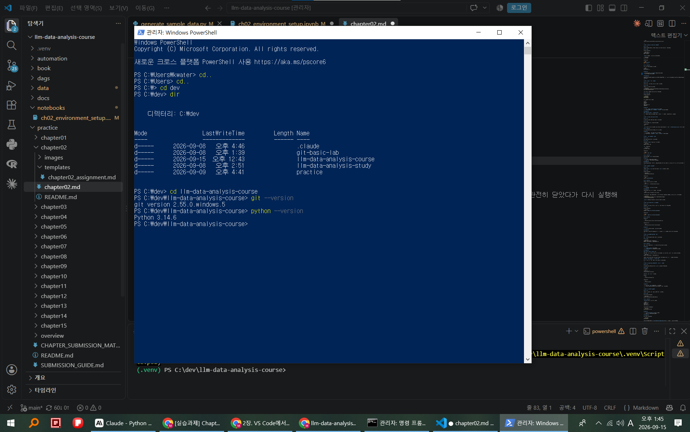

- [Comment] powershell 터미널에서 git과 python 버젼을 확인한 결과 git은 2.55.0 / python은 3.14.6 버젼을 확인하였다. 교수님은 python 3.12버젼을 사용하신다고 했지만 실습에 3.14 버젼을 사용해도 크게 상관없다 하셔서 유지하려고 한다. 별도의 오류발생은 없는 것으로 보아 path연결이 잘 되었다고 판단된다.

## 오류가 나면

명령을 찾을 수 없다면 설치가 안 되어 있거나 PATH가 연결되지 않은 상태일 수 있습니다. 설치 후 VS Code와 터미널을 완전히 닫았다가 다시 실행해 확인합니다.

---

# STEP 2. Public 저장소 준비하기

## 2-1. 목적

학생이 사용할 공식 실습 파일을 로컬 PC에 준비합니다.

## 2-2. 실행

원하는 개발 폴더에서 실행합니다.

```powershell
git clone https://github.com/GilbertMoon/llm-data-analysis-course.git
cd llm-data-analysis-course
```

이미 clone한 경우에는 프로젝트 폴더로 이동합니다.

## 2-3. 결과 확인

Windows PowerShell:

```powershell
Get-Location
Get-ChildItem
```

다음 항목들이 보여야 합니다.

```text
data
notebooks
scripts
src
requirements.txt
README.md
```

## 성공 기준

- [x] 현재 폴더가 `llm-data-analysis-course`입니다.
- [x] `requirements.txt`, `notebooks`, `scripts`, `data`가 보입니다.
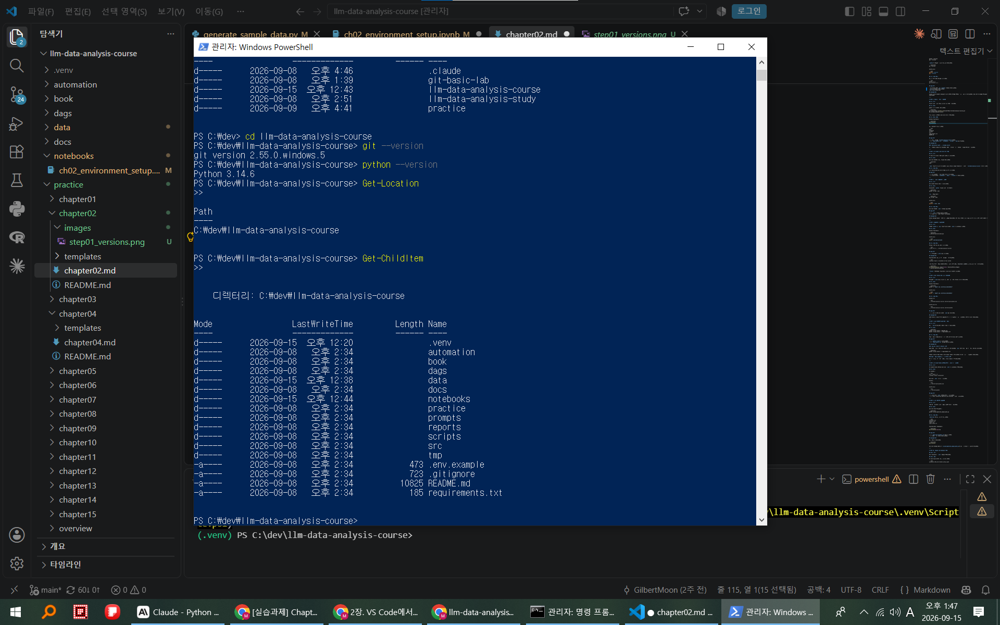
- [Comment] 실습 절차와 같이 llm-data-analyst-course를 clone하여 내려받고자 했으나 전차에 교수님의 실습파일들을 clone하여 내려받았기 때문에 폴더들이 더 많은것을 확인하였다. 따라서 기존에 내려받은 폴더/파일들을 일부 삭제하고 실습코스를 따라갔다. 잘못 관리하다가는 개인 저장소들이 뒤죽박죽이 될 수 있기떄문에 관리가 잘 필요하다는 생각이 드는 부문이다.


## 오류가 나면

### `destination path ... already exists`

같은 이름의 폴더가 이미 있습니다. 기존 저장소인지 먼저 확인하고 무작정 삭제하지 않습니다.

---

# STEP 3. VS Code로 프로젝트 폴더 열기

## 3-1. 목적

이 강좌는 VS Code를 기본 작업 공간으로 사용합니다.

## 3-2. 실행

프로젝트 루트에서 다음 명령을 실행합니다.

```powershell
code .
```

`code` 명령이 안 되면 VS Code에서 직접 **File → Open Folder**를 선택하고 `llm-data-analysis-course` 폴더를 엽니다.

## 3-3. 예상 결과

왼쪽 Explorer에 프로젝트 폴더와 파일이 표시됩니다.

## 성공 기준

- [x] VS Code에서 저장소 루트 폴더를 열었습니다.
- [x] Explorer에서 `notebooks/`, `data/`, `scripts/`를 확인했습니다.
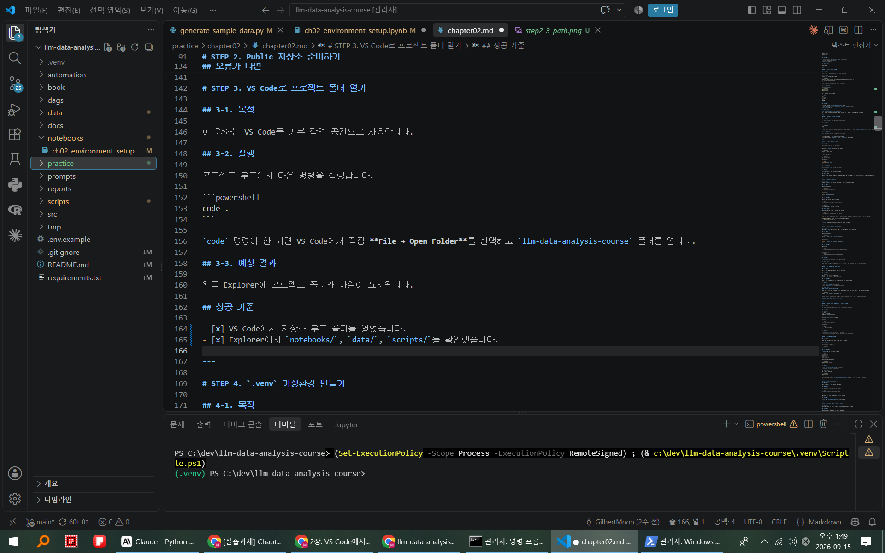
- [Comment] vscode explorer에서 notebooks와 data, scripts 폴더가 있음을 확인하였다. 터미널에서 code. 실행도 문제 없었다. 초기 설정에 문제가 없음이 확인되는 부분이다.

---

# STEP 4. `.venv` 가상환경 만들기

## 4-1. 목적

프로젝트별 Python 패키지를 분리합니다.

## 4-2. 실행

Windows에서 `python` 명령을 사용할 수 있다면:

```powershell
python -m venv .venv
```

`py`만 동작한다면:

```powershell
py -m venv .venv
```

macOS/Linux:

```bash
python3 -m venv .venv
```

## 4-3. 예상 결과

프로젝트 루트에 `.venv` 폴더가 생성됩니다.

## 성공 기준

- [x] `.venv` 폴더가 생성되었습니다.
- [x] 오류 메시지 없이 명령이 끝났습니다.
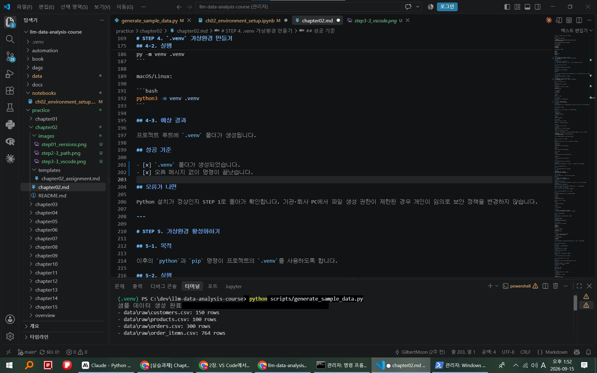
- [Comment] vscode explorer창에 .venv 폴더가 생긴것을 확인하였다. 각 프로젝트에 맞는 패키지(?)를 써야된다는 사실도 처음 알게 되었고 때문에 프로젝트별 가상환경을 설정해야된다는 점이 흥미로운 부분이었다.

## 오류가 나면

Python 설치가 정상인지 STEP 1로 돌아가 확인합니다. 기관·회사 PC에서 파일 생성 권한이 제한된 경우 개인이 임의로 보안 정책을 변경하지 않습니다.

---

# STEP 5. 가상환경 활성화하기

## 5-1. 목적

이후의 `python`과 `pip` 명령이 프로젝트의 `.venv`를 사용하도록 합니다.

## 5-2. 실행

Windows PowerShell:

```powershell
.\.venv\Scripts\Activate.ps1
```

macOS/Linux:

```bash
source .venv/bin/activate
```

## 5-3. 예상 결과

터미널 앞에 보통 다음처럼 표시됩니다.

```text
(.venv) PS C:\...\llm-data-analysis-course>
```

## 성공 기준

- [x] 터미널에 `(.venv)`가 표시됩니다.
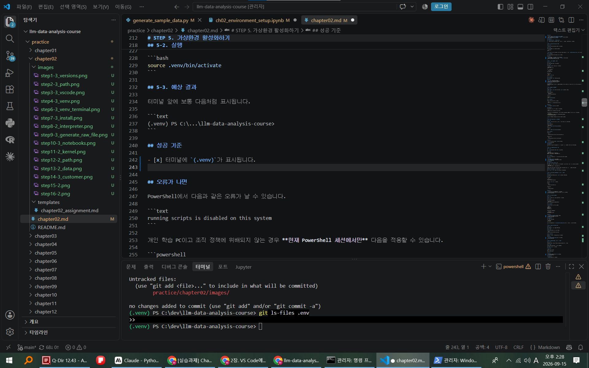
- [Comment] vscode 하단 터미널창에 .venv 표시가 된 것을 확인하였다. 처음에는 .venv 표시가 되지 않아 새 터미널을 생성하니 문제없이 출력되었다. 강의 상에는 .venv가 바로 표시가 되었으나 내 pc환경에는 그리 되지 않아 의구심이 들었지만 큰 문제가 아니라 판단된다.


## 오류가 나면

PowerShell에서 다음과 같은 오류가 날 수 있습니다.

```text
running scripts is disabled on this system
```

개인 학습 PC이고 조직 정책에 위배되지 않는 경우 **현재 PowerShell 세션에서만** 다음을 적용할 수 있습니다.

```powershell
Set-ExecutionPolicy -Scope Process -ExecutionPolicy Bypass
.\.venv\Scripts\Activate.ps1
```

`Process` 범위이므로 PowerShell 창을 닫으면 설정이 끝납니다.

---

# STEP 6. 실제 Python 실행 파일 확인하기

## 6-1. 목적

터미널에 `(.venv)`가 표시되는 것만 믿지 않고 실제 Python 경로를 확인합니다.

## 6-2. 실행

Windows PowerShell:

```powershell
python -c "import sys; print(sys.executable)"
```

macOS/Linux:

```bash
python -c 'import sys; print(sys.executable)'
```

## 6-3. 예상 결과

Windows 예:

```text
...\llm-data-analysis-course\.venv\Scripts\python.exe
```

macOS/Linux 예:

```text
.../llm-data-analysis-course/.venv/bin/python
```

## 성공 기준

- [x] 출력 경로에 프로젝트의 `.venv`가 포함됩니다.
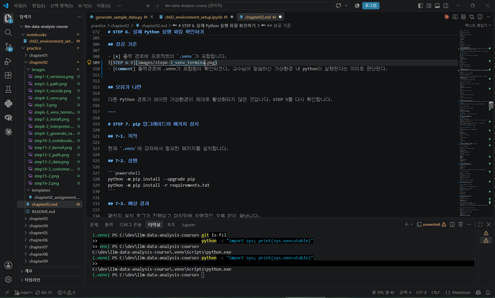
- [Comment] 출력경로에 .venv가 포함됨이 확인되었다. 교수님이 말씀하신 가상환경 내 python이 실행된다는 의미로 판단된다. 


## 오류가 나면

다른 Python 경로가 보이면 가상환경이 제대로 활성화되지 않은 것입니다. STEP 5를 다시 확인합니다.

---

# STEP 7. pip 업그레이드와 패키지 설치

## 7-1. 목적

현재 `.venv`에 강좌에서 필요한 패키지를 설치합니다.

## 7-2. 실행

```powershell
python -m pip install --upgrade pip
python -m pip install -r requirements.txt
```

## 7-3. 예상 결과

패키지 설치 로그가 진행되고 마지막에 치명적인 오류 없이 끝납니다.

## 성공 기준

- [x] `python -m pip`를 사용했습니다.
- [x] `requirements.txt` 설치가 완료되었습니다.
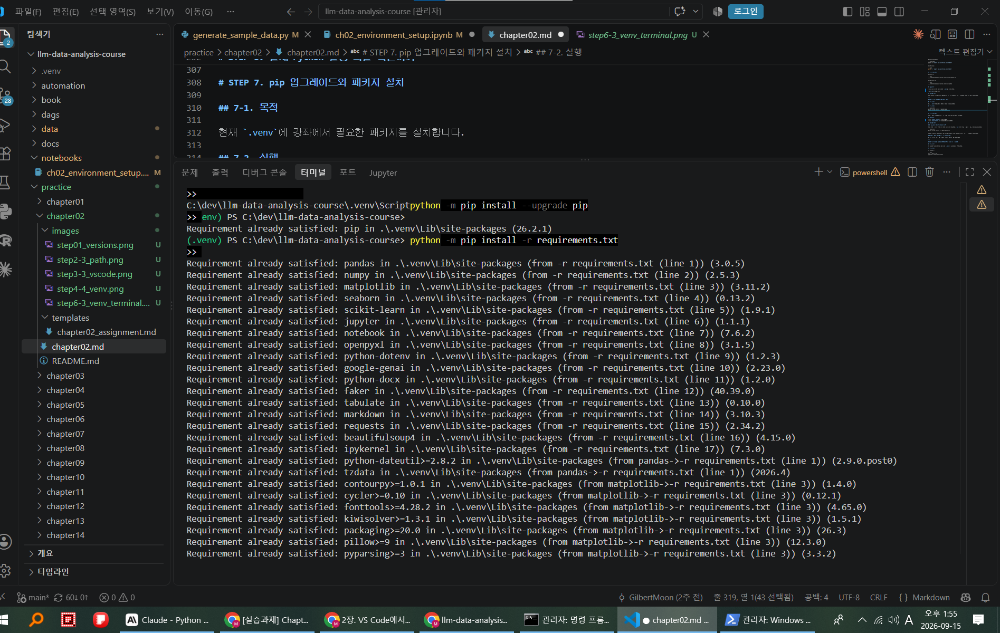
- [Comment] 업그래이트 패키지와 requirement에 있는 패키지가 모두 설치완료 되었다. pandas 등 실습데이터 분석에 필요한 툴들을 모두 준비 했다는 의미로 판단된다.

## 오류가 나면

### `pip.exe` 실행이 차단되는 경우

조직 PC의 애플리케이션 제어 정책 문제일 수 있습니다. `pip` 단독 명령 대신 먼저 다음 형식을 사용합니다.

```powershell
python -m pip install -r requirements.txt
```

그래도 차단되면 조직 정책일 수 있으므로 임의로 보안 설정을 해제하지 않고 관리자에게 확인합니다.

### 패키지 설치 오류가 여러 개 보이는 경우

맨 마지막 줄만 보지 말고 **처음 발생한 오류**부터 확인합니다.

---

# STEP 8. VS Code Python 인터프리터를 `.venv`로 선택하기

## 8-1. 목적

VS Code의 Python 기능도 프로젝트 `.venv`를 사용하도록 연결합니다.

## 8-2. 실행

VS Code에서:

```text
Ctrl + Shift + P
→ Python: Select Interpreter
```

프로젝트 `.venv` 경로를 선택합니다.

Windows:

```text
...\.venv\Scripts\python.exe
```

macOS/Linux:

```text
.../.venv/bin/python
```

## 성공 기준

- [x] 프로젝트 `.venv` 인터프리터를 선택했습니다.
- [x] 시스템 Python이나 다른 프로젝트 Python을 선택하지 않았습니다.
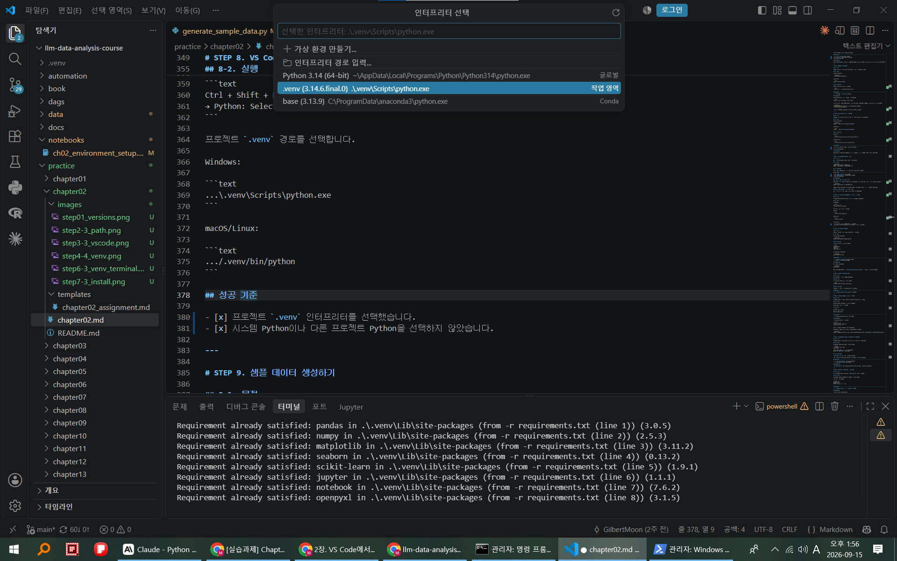
- [Comment] 파이썬 인터프리터로 .venv경로를 선택 완료 하였다. 이로써 가상환경 상 파이썬을 쓴다는 환경설정이 끝난 것으로 판단된다.
---

# STEP 9. 샘플 데이터 생성하기

## 9-1. 목적

이후 모든 분석에서 사용할 가상 쇼핑몰 CSV를 준비합니다.

## 9-2. 실행

프로젝트 루트 터미널에서:

```powershell
python scripts/generate_sample_data.py
```

## 9-3. 예상 결과

`data/raw/`에 다음 파일이 존재합니다.

```text
customers.csv
products.csv
orders.csv
order_items.csv
```

PowerShell에서 확인하려면:

```powershell
Get-ChildItem data\raw
```

## 성공 기준

- [x] `data/raw/customers.csv`가 존재합니다.
- [x] 나머지 3개 CSV도 확인했습니다.
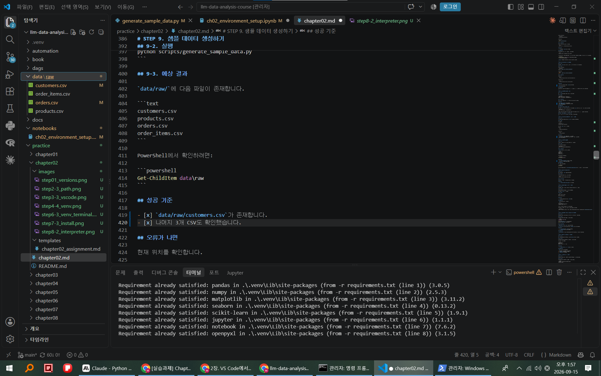
- [Comment] 데이터 4개의 파일을 생성완료 하였다. 서두에 언급한 대로 당초 교수님의 자료를 모두 내려받았기 떄문에 해당 폴더를 삭제하고 새로 생성하여 추진했다. 파일 내의 데이터도 문제없는 것으로 확인된다. 

## 오류가 나면

현재 위치를 확인합니다.

```powershell
Get-Location
```

프로젝트 루트가 아니라면 `scripts/generate_sample_data.py`의 상대 경로가 맞지 않을 수 있습니다.

---

# STEP 10. Chapter 02 Notebook 열기

## 10-1. 목적

실제 Notebook과 `.venv` 커널을 연결합니다.

## 10-2. 실행

VS Code Explorer에서 다음 파일을 엽니다.

```text
notebooks/ch02_environment_setup.ipynb
```

## 10-3. 예상 결과

Markdown 셀과 Code 셀이 Notebook 형식으로 보입니다.

## 성공 기준

- [x] `ch02_environment_setup.ipynb`를 열었습니다.
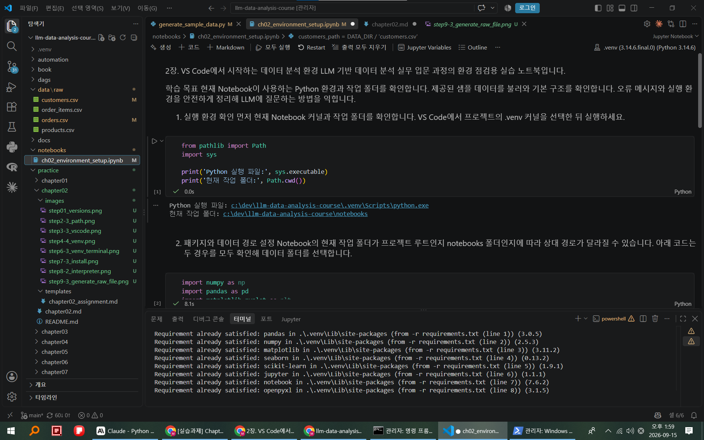
- [Comment] 이 부분도 마찬가지로 당초에 챕터02의 노트북이 있었기 때문에 강의를 따라 기존파일을 삭제하고 새로 생성하여 추진하였다. 노트북 상에서 마크다운과 코드가 분리되어 있어 코드가 바로 실행이 되는게 인상적인 부분이다.

---

# STEP 11. Notebook 커널을 `.venv`로 선택하기

## 11-1. 목적

터미널에서 패키지를 설치한 Python과 Notebook Python을 같게 만듭니다.

## 11-2. 실행

Notebook 오른쪽 위의 커널 선택 메뉴를 누릅니다.

프로젝트의 `.venv`를 선택합니다.

## 핵심 원칙

```text
패키지를 설치한 Python
=
Notebook 커널 Python
```

## 성공 기준

- [x] Notebook 커널이 프로젝트 `.venv`입니다.
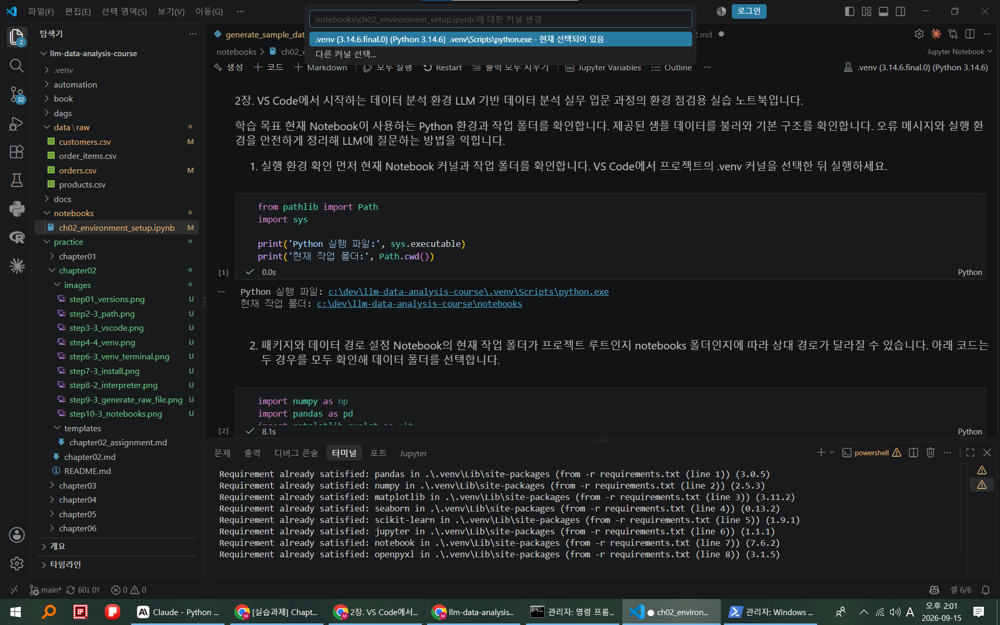
- [Comment] 우측 상단에 커널이 .venv임을 확인하였다. 터미널에서 패키지를 설치한 파이썬과 노트북 파이썬도 같게 되었다고 판단된다. 


## 오류가 나면

`.venv`가 목록에 보이지 않는다면:

```text
Ctrl + Shift + P
→ Python: Select Interpreter
→ 프로젝트 .venv 선택
```

그 다음 VS Code를 Reload하고 다시 확인합니다.

정말 필요한 경우에만 다음 명령으로 사용자 커널을 등록합니다.

```powershell
python -m ipykernel install --user --name llm-data-analysis-course --display-name "llm-data-analysis-course"
```

---

# STEP 12. Notebook에서 Python 경로와 작업 폴더 확인하기

## 12-1. 목적

Notebook이 실제로 어떤 Python과 폴더를 기준으로 실행되는지 확인합니다.

## 12-2. 실행

Notebook의 **실행 환경 확인** 셀을 실행합니다.

```python
from pathlib import Path
import sys

print('Python 실행 파일:', sys.executable)
print('현재 작업 폴더:', Path.cwd())
```

## 12-3. 예상 결과

`Python 실행 파일`에 `.venv` 경로가 포함됩니다.

`현재 작업 폴더`는 프로젝트 루트 또는 `notebooks` 폴더일 수 있습니다.

## 성공 기준

- [x] `sys.executable`에 `.venv`가 포함됩니다.
- [x] `Path.cwd()` 결과를 기록했습니다.
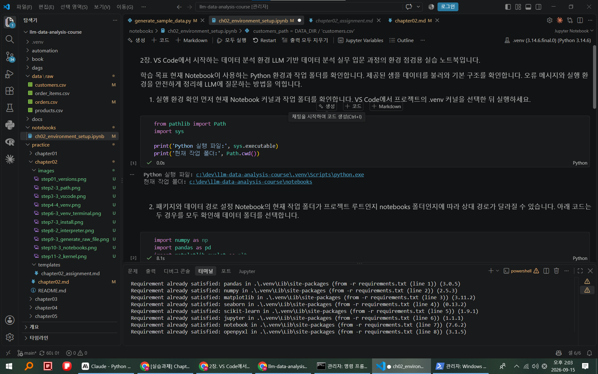
- [Comment] 노트북 상 코드에서 해당 경로가 문제없이 출력되는 것을 확인하였다. 현재 사용하는 파이썬이 가상환경에 있는 파이썬이라는 점을 재확인하였다.


## 오류가 나면

`sys.executable`이 시스템 Python을 가리키면 STEP 11의 커널 선택을 다시 확인합니다.

---

# STEP 13. 데이터 경로 자동 확인 셀 실행하기

## 13-1. 목적

현재 Notebook의 작업 폴더에 따라 올바른 `data/raw` 위치를 찾습니다.

## 13-2. 실행

Notebook의 **패키지와 데이터 경로 설정** 셀을 실행합니다.

핵심 출력은 다음입니다.

```text
프로젝트 루트: ...
데이터 폴더: ...
데이터 폴더 존재 여부: True
```

## 성공 기준

- [x] `데이터 폴더 존재 여부: True`가 표시됩니다.
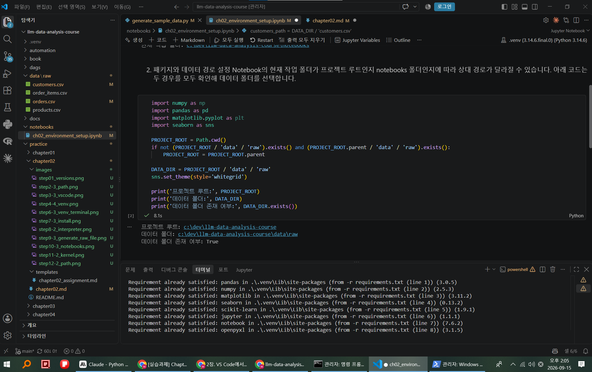
- [Comment] 데이터 폴더 존재여부를 true로 확인하였다. 이는 이전 단계에서 제너레이트-샘플데이터로 처리한 폴더를 재확인한 셈이며 노트북의 작업폴더와도 경로가 맞다는 의미로 판단된다.


## 오류가 나면

`False`라면 다음을 확인합니다.

1. STEP 9에서 샘플 데이터를 생성했는가?
2. `data/raw` 폴더가 실제로 있는가?
3. `Path.cwd()`는 어디인가?

---

# STEP 14. `customers.csv` 불러오기

## 14-1. 목적

Notebook, 커널, 패키지, 데이터 경로가 모두 연결됐는지 최종 확인합니다.

## 14-2. 실행

Notebook의 **샘플 데이터 불러오기** 셀을 실행합니다.

```python
customers = pd.read_csv(customers_path)
customers.head()
```

## 14-3. 예상 결과

고객 데이터의 처음 몇 행이 표 형태로 출력됩니다.

## 성공 기준

- [x] `customers.head()`가 정상 표시됩니다.
- [x] `FileNotFoundError`가 없습니다.
- [x] `ModuleNotFoundError`가 없습니다.
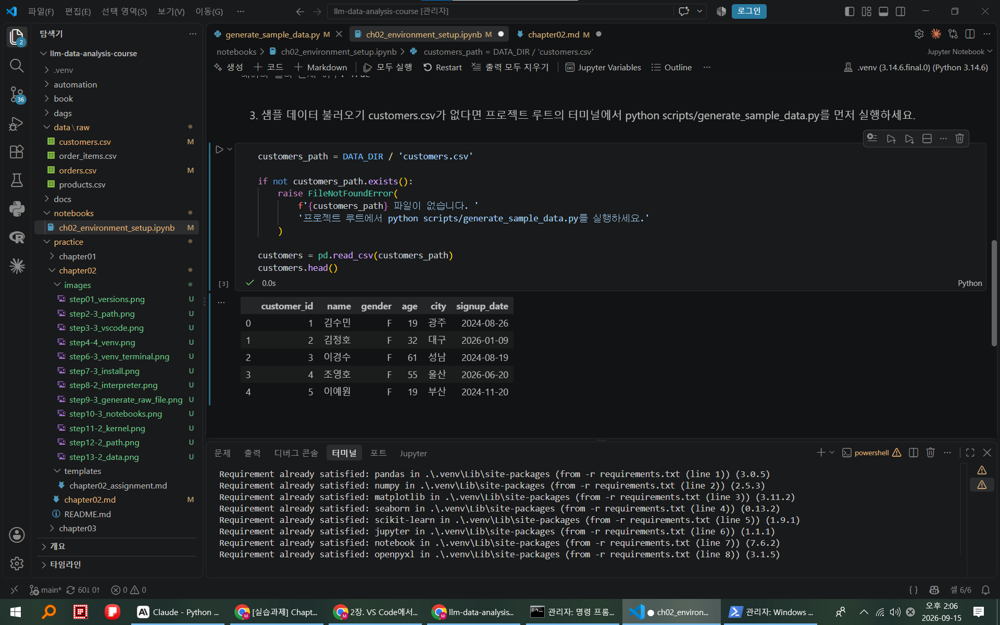
- [Comment] 이도 마찬가지로 이전에 생성한 샘플데이터를 올바르게 가져오는지를 확인한 부분이며 고객데이터의 행이 표로 생성됨을 보여준다. 별도의 오류사항은 없다. 

## 오류가 나면

### `ModuleNotFoundError`

패키지를 설치한 `.venv`와 Notebook 커널이 같은지 확인합니다.

### `FileNotFoundError`

다음 순서대로 확인합니다.

```text
customers.csv 실제 존재 여부
→ Path.cwd()
→ PROJECT_ROOT
→ DATA_DIR
```

---

# STEP 15. 데이터 기본 구조 확인하기

## 15-1. 목적

환경이 연결되었는지 데이터 구조 출력까지 확인합니다.

## 15-2. 실행

Notebook의 **기본 구조 확인** 셀을 실행합니다.

```python
print('데이터 크기:', customers.shape)
print('컬럼명:', customers.columns.tolist())
customers.info()
```

## 성공 기준

- [x] 행과 열의 수가 출력됩니다.
- [x] 컬럼 목록이 출력됩니다.
- [x] `customers.info()`가 오류 없이 실행됩니다.
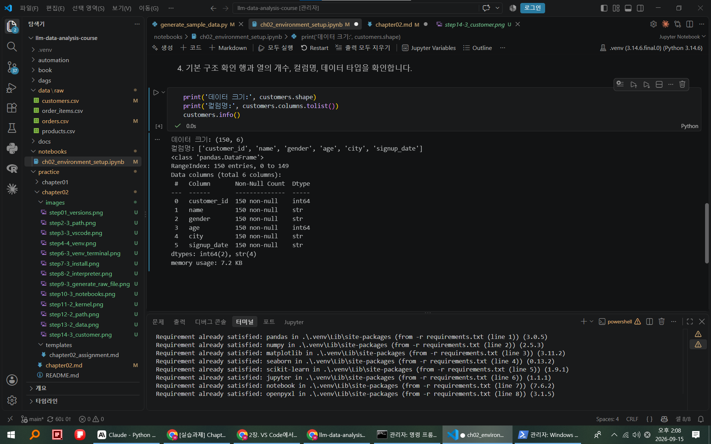

- [Comment] 샘플데이터의 행과열, 컬럼등이 모두 문제없이 출력됨을 확인하였다. 

> 정확한 데이터 해석은 Chapter 03에서 본격적으로 진행합니다. 여기서는 환경 연결 확인이 목적입니다.

---

# STEP 16. `.env`와 Secret 보호 확인하기

## 16-1. 목적

후반부 API 실습 전에 비밀정보 관리 원칙을 확인합니다.

## 16-2. 실행

`.gitignore`에 다음 항목이 있는지 확인합니다.

```text
.env
.venv/
__pycache__/
.ipynb_checkpoints/
```

필요한 경우 `.env.example`을 복사해 개인 `.env`를 만듭니다.

Windows:

```powershell
Copy-Item .env.example .env
```

Git 상태를 확인합니다.

```powershell
git status
git ls-files .env
```

## 성공 기준

- [x] 실제 API Key를 코드에 직접 적지 않습니다.
- [x] `.env`가 Git 추적 대상이 아닙니다.
- [x] Notebook 출력이나 화면 캡처에도 Secret을 노출하지 않습니다.
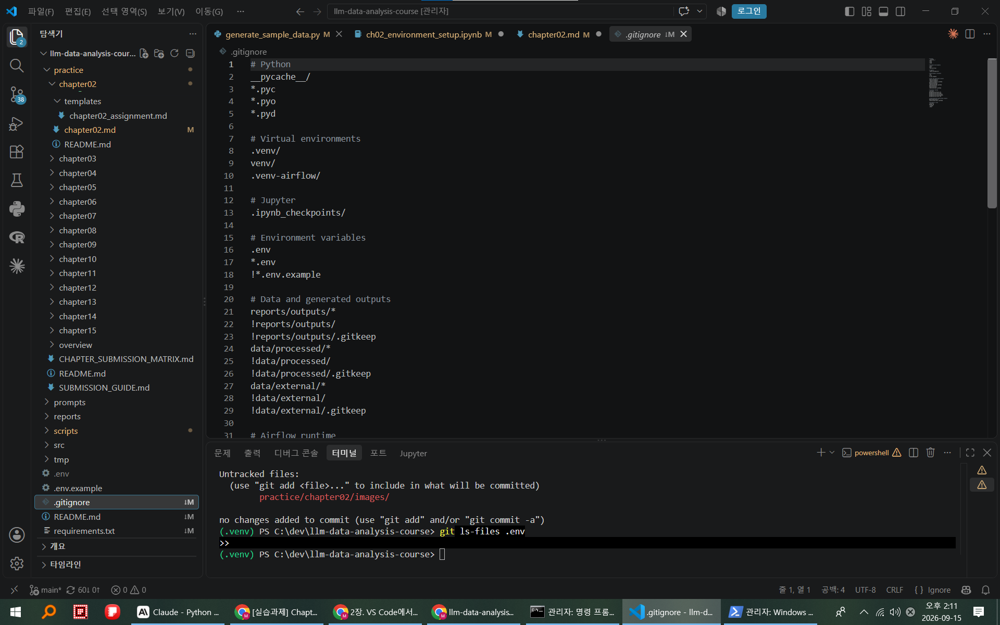
- [Comment] .gitignore상에서  .env 등을 추적하지 않도록 설정해놓았음을 확인하였다. 이외 .venv , pycache 등도 올바르게 포함되어 있었다.

---

# STEP 17. 환경 오류를 LLM에 안전하게 질문하기

## 17-1. 목적

오류를 막연하게 질문하지 않고 검증 가능한 정보로 설명합니다.

## 17-2. 실행

다음 템플릿을 사용합니다.

```text
운영체제: Windows
편집기: VS Code
현재 작업 폴더: [Path.cwd() 결과]
Python 실행 파일: [sys.executable 결과]
실행한 명령 또는 코드: [...]
오류 메시지: [민감정보 제거 후 붙여넣기]

초보자가 이해할 수 있게 원인을 설명하고,
영향이 작은 확인 방법부터 순서대로 알려 주세요.
```

## 성공 기준

- [x] 오류 메시지를 구체적으로 제공합니다.
- [x] API Key·비밀번호·토큰·개인정보를 제거합니다.
- [x] 파일 삭제나 시스템 변경 명령은 이유를 확인한 뒤 실행합니다.

---

# 최종 검증

Chapter 02 완료 전에 다음을 모두 확인합니다.

- [x] Public 저장소를 정상적으로 준비했습니다.
- [x] 프로젝트 루트에서 VS Code를 열었습니다.
- [x] `.venv`를 만들고 활성화했습니다.
- [x] `sys.executable`이 `.venv`를 가리킵니다.
- [x] `requirements.txt` 설치가 완료되었습니다.
- [x] VS Code Python 인터프리터가 `.venv`입니다.
- [x] 샘플 CSV 4개가 `data/raw/`에 있습니다.
- [x] Chapter 02 Notebook을 열었습니다.
- [x] Notebook 커널이 `.venv`입니다.
- [x] Notebook의 `sys.executable`에 `.venv`가 포함됩니다.
- [x] `DATA_DIR.exists()`가 `True`입니다.
- [x] `customers.head()`가 정상 표시됩니다.
- [x] `customers.shape`, 컬럼명, `info()`가 출력됩니다.
- [x] 실제 Secret을 GitHub에 올리지 않습니다.

---

# 최종 산출물

Chapter 02에서 남겨야 할 완료 Evidence는 다음과 같습니다.

```text
1. 터미널의 Python 실행 파일 경로
2. Notebook의 sys.executable 결과
3. Notebook의 Path.cwd() 결과
4. DATA_DIR 존재 여부 True
5. customers.head() 정상 출력
6. 데이터 shape와 컬럼 목록
7. .env가 Git 추적 대상이 아님을 확인
```

수업 운영자가 화면 제출을 요구한다면 **Notebook에서 환경 확인 결과와 `customers.head()`가 함께 보이는 화면**을 남기면 좋습니다.

---

# 다음 장 준비

다음은 **3장. 데이터의 첫인상 읽기**입니다.

Chapter 03에서는 지금 준비한 환경을 사용해 CSV 데이터의 행·열, 컬럼명, 데이터 타입, 결측치, 키와 관계를 본격적으로 확인합니다.